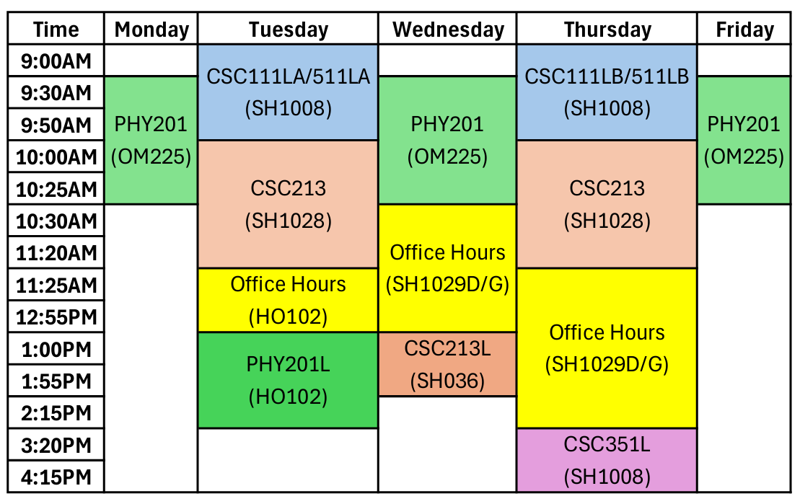

# Common Syllabus Information for Fall 2026

## Instructor
**Instructor:** Jon Mrowczynski  
**Email:** mrowczy1@canisius.edu  
**Phone:** 716-405-0709  
**Office:** SH1029D  
**Schedule (including Office Hours):**  

### Office Hours can also be made by appointment!

## Grading Scale

| % of Total Points | Grade |
|:---:|:---:|
| \[93, 100\] | A |
| \[90, 93\) | A- |
| \[87, 90\) | B+ |
| \[83, 87\) | B |
| \[80, 83\) | B- |
| \[77, 80\) | C+ |
| \[73, 77\) | C |
| \[70, 73\) | C- |
| \[65, 70\) | D |
| \[0, 65\) | F |

## Attendance and Tardiness
Students in this course are expected to be present for class meetings. Attendance will be taken each class period. If a student is unable to make a meeting or several meetings, please let me know that you will be unable to attend. Your total allowable absences are dependant upon the number of meetings the class has per week and are displayed below.

| Meetings/Week | Absences Allowed |
|:---:|:---:|
| 3 | 5 |
| 2 | 3 |
| 1 | 1 |

If you miss more than the allowed absences without an excuse or with an undocumented or invalid excuse, you may be given a failing grade of FX. The professor will tell you whether your excuse is invalid. Health excuses require medical documentation. 3 late arrivals (more than 10 minutes late) will equal 1 absence.

Students who are unable to attend class or participate in coursework requirements on a particular day because of their religious beliefs will be granted a makeup opportunity, provided that the student alerts the instructor at least one week in advance. Any absence due to a religious holiday falling on a class day will be excused if the student alerts me of the absence.

## Calculators and Computers
A significant portion of lab is the analysis. Tools such as scientific calculators and computers are useful to analyze the data and prepare the results.  Graphing and statistical packages may be needed. Students are responsible for the use and maintenance of any computers, software, or calculators used.

## Cellphones
I understand that cell phones are an important part of many people's lives. However, the classroom instruction time is limited, and cell phones cannot be allowed to interfere with other students' effective use of that time. Therefore, the following restrictions apply:

- No audible ringing will be allowed. Turn it off or set it to a non-audible ring.
- In consideration of other students, you are expected to leave the classroom if you need to answer or make a call.
    - You are responsible for any material discussed in your absence.
    - You are expected to obtain this information from your fellow students.
- **Taking pictures of notes with a camera (unless otherwise encouraged to do so) will result in a 1 point decrease of your final grade per occurrence.**

## Food and Drinks 
Because of the risk of damage to equipment, food and beverages are not allowed to be consumed in the classroom or laboratory.  If you bring a beverage container with a tight lid and keep it away from the equipment, you will have ample opportunity to enjoy it outside of class.

## Email 
Email is a very effective way to get in touch with me. I recommend using your Canisius account or setting your account to forward to a different address if you prefer. During the week (M-F), I can typically respond within a day. On the weekends and evenings, I may not check my account that regularly. To protect confidentiality, I will not discuss grades via email or telephone, only in person.

## [Academic Integrity](https://catalog.canisius.edu/undergraduate/academics/academic-policies/code-academic-integrity/)
I consider academic dishonesty to be a serious offense and reserve the right to fully enforce the university’s policies. When collaborating with other students, be sure to turn in work that reflects your efforts and understanding of the material.

## Special Problems and Accessibility Support
[The Golisano Center for Student Success](https://www.canisius.edu/student-experience/golisano-center-student-success) serves as the University's advocate for students with disabilities and is responsible for arranging necessary support. Any student who needs academic accommodations should contact the [Accessibility Support](https://www.canisius.edu/student-experience/golisano-center-student-success) (AS) Office at 716-888-2476 or the Golisano Center at 716-888-2170. If you have a disability for which accommodations are necessary, please also inform the instructor. 

For more information about the AS Office or academic accommodations, please visit the [accessibility support web page](https://www.canisius.edu/student-experience/golisano-center-student-success/student-accessibility-services) or call 716-888-2476.

## Generative AI
Canisius University has adopted the [AI Assessment Scale](https://aiassessmentscale.com). This course will indicate what level of AI use is acceptable for each assignment. If such tools are authorized, use must be documented on the student submission, unless this requirement is explicitly waived. All members of the Canisius University community agree to exercise complete honesty in their academic work and accept responsibility for maintaining academic integrity.
